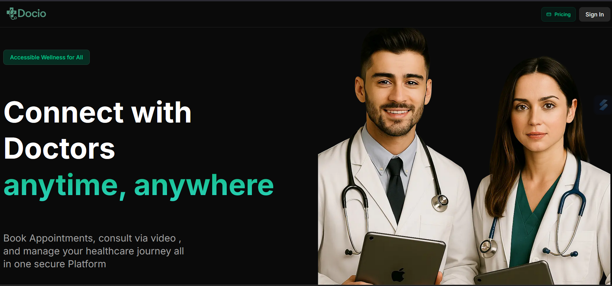

# 🩺 Docio — Doctors Appointment Platform

🧑‍⚕️ Docio is a full-stack web application built with Next.js ⚛️ that enables patients to seamlessly book appointments 🗓️ with doctors through a sleek, responsive UI 📱. Real-time video Call communication 🔔 powered by Vonage 📞,Efficient database management 📊 using Prisma
Gorgeous interfaces 🎨 crafted with Tailwind CSS 🌬️ and shadcn/ui 🧩,
Effortless deployment 🚀 on Vercel .

---
## 🚀 Tech Stack

| Technology   | Role                          |
| ------------ | ----------------------------- |
| Next.js      | React-based framework          |
| Tailwind CSS | Utility-first CSS styling      |
| Prisma       | ORM for database access        |
| Vonage       | Real-time video calling        |
| shadcn/ui    | Reusable component library     |
| Vercel       | Hosting & deployment platform  |

---


## 🌐 Live Demo

🔗 [Visit Docio](https://docio-haribabu.vercel.app/)

## 📸 Preview


## 📸 Features
- 👨‍⚕️ **Doctor & Patient Role Management**  
- 📅 **Appointment Scheduling with Slot Management**  
- 💬 **Real-Time Video Consultations using Vonage**  
- 🎨 **Fully Responsive UI** with Tailwind CSS + shadcn/ui  
- 🔐 **Secure Authentication & Access Control**  
- ⚙️ **Prisma-powered Database with Schema Migrations**  
- 💳 **Credit-Point Based Payment System** — Patients use **2 credits** to book an appointment, making budgeting simpler and frictionless  
- 🧾 **Automated Doctor Payouts** — Doctors earn credits through consultations, with effortless withdrawals via **PayPal** linked to their email  

---

## 🧑‍💻 Getting Started

### 1. Clone the Repo
```bash
git clone https://github.com/your-username/docio.git
cd docio
```
### 2. Install Dependencies
```bash
npm install
# or
npm i
```
### 3. Set Up Environment Variables
``` bash
DATABASE_URL=your-prisma-database-url

VONAGE_PRIVATE_KEY = /private.key
NEXT_PUBLIC_VONAGE_APPLICATION_ID=your-vonage-app-id

NEXT_PUBLIC_CLERK_SIGN_IN_URL =/sign-in
NEXT_PUBLIC_CLERK_SIGN_UP_URL =/sign-up

NEXT_PUBLIC_CLERK_AFTER_SIGN_IN_URL = /onboarding
NEXT_PUBLIC_CLERK_AFTER_SIGN_UP_URL = /onboarding

NEXT_PUBLIC_CLERK_PUBLISHABLE_KEY=your-clerk-key
CLERK_SECRET_KEY=your-clerk-secret-key
```

### 4. Run Locally
```bash
npx prisma generate
npx prisma migrate dev --name init
npm run dev

```


 ## 📌 Connect with Me

[](https://www.linkedin.com/in/haribabu-g/)  


## Contributing 🤝

Feel free to fork the repo, submit issues, or create pull requests if you'd like to contribute to the project!

---

<div align="center">
✨If you like this repo, consider giving it a star! ⭐
   <div align="center">
      Made with ❤️ by @Haribabu-g
   </div>
</div>

